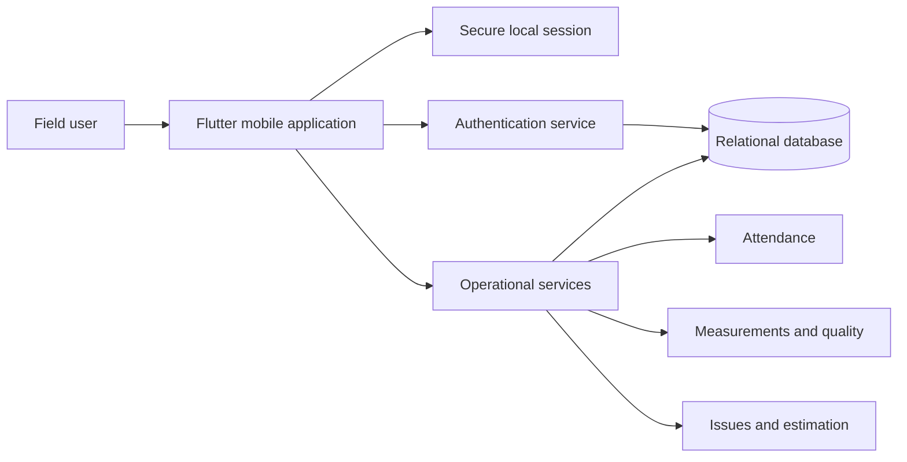

# Sanitized architecture overview

This document describes the solution at a high level without exposing internal code, infrastructure names or production configuration.

## Logical view

## Design approach

- A mobile shell provides navigation, localization and session handling.
- Business capabilities are separated into focused backend services.
- Shared components centralize data access, token validation and permissions.
- Role-based rules limit actions and information according to responsibility.
- Health endpoints and clear service boundaries support operational monitoring.

## Security boundaries

- Credentials and environment values remain outside source control.
- Tokens are stored using secure mobile storage.
- Protected operations validate both identity and permission.
- Public portfolio assets use only fictional or masked information.

## Portfolio scope

This diagram is intentionally generic. It omits proprietary schemas, endpoints, network topology, deployment details and organization-specific rules.
